# 🌱 Smart Farm IoT System with Zero-Touch Provisioning

> KubeEdge 기반 3-Tier Edge Computing 아키텍처를 활용한 스마트팜 IoT 시스템
> Arduino 센서 디바이스 → Raspberry Pi 엣지 서버 → Kubernetes 클라우드

**20215105 변진철 · 20215140 윤진현**
*개발 보조 도구: Claude*
*문서 작성 보조 도구: Claude, ChatGPT*

---

## 아키텍처

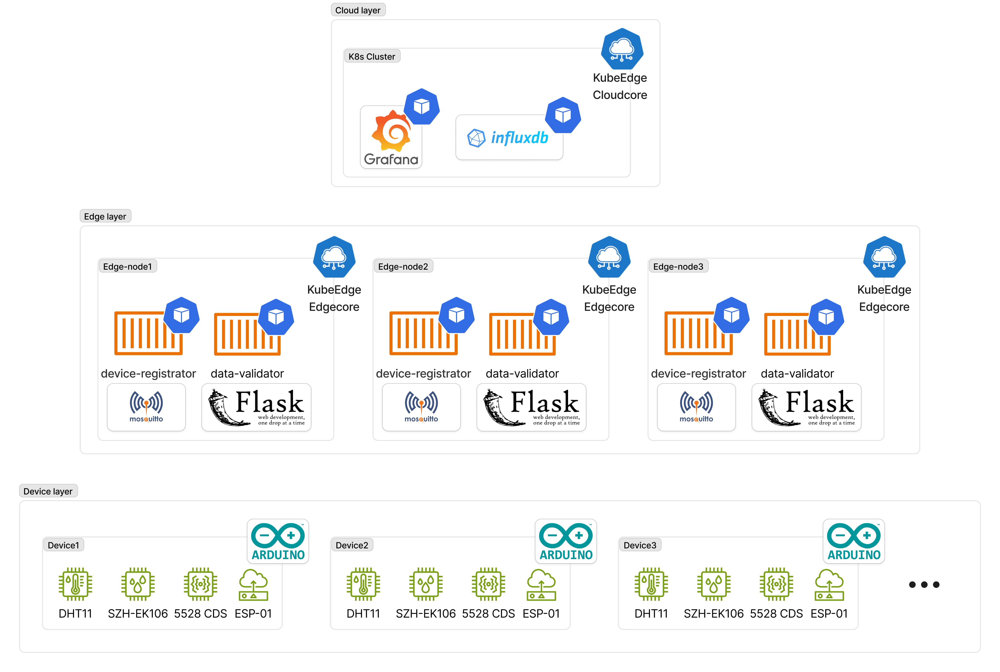

전체 시스템은 3개 계층으로 구성됩니다.

| 계층 | 구성 | 역할 |
|---|---|---|
| **Cloud Layer** | K8s Cluster (KubeEdge Cloudcore, InfluxDB, Grafana) | 중앙 모니터링 및 데이터 시각화 |
| **Edge Layer** | Raspberry Pi × 3 (device-registrator, data-validator) | 디바이스 등록, 데이터 집계·검증·전송 |
| **Device Layer** | Arduino UNO + ESP-01 × 7 (DHT11, SZH-EK106, 5528 CDS) | 센서 데이터 수집 및 MQTT 전송 |

---

## 시스템 워크플로우

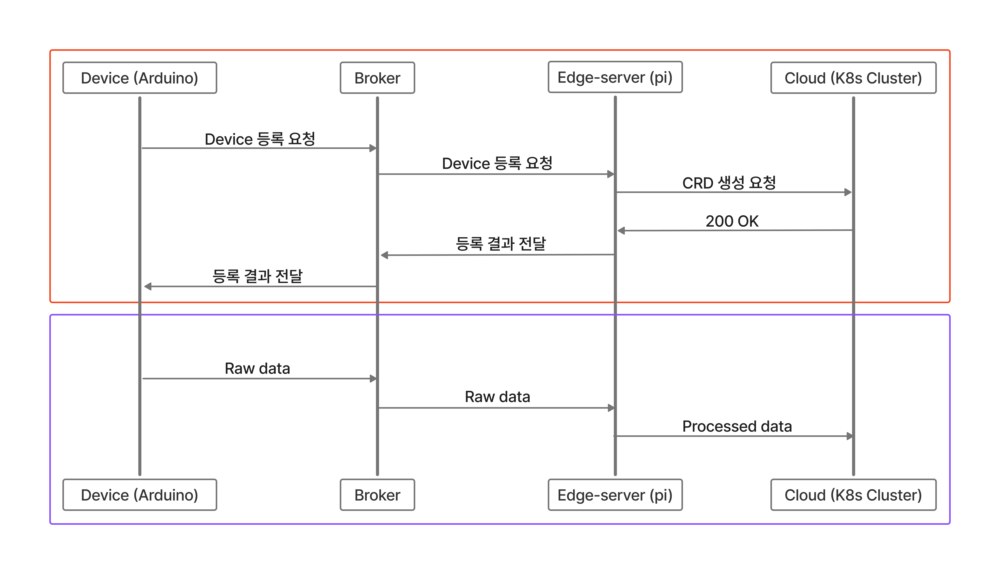

전체 흐름은 두 단계로 구분됩니다. 빨간 박스는 ZTP 등록 단계이고, 파란 박스는 이후 정상 운영 중 데이터 파이프라인 단계입니다.

---

## 핵심 기능

### 1. Zero-Touch Provisioning (ZTP)

고장난 센서를 교체할 때 별도 설정 없이 전원만 연결하면 자동 등록됩니다.

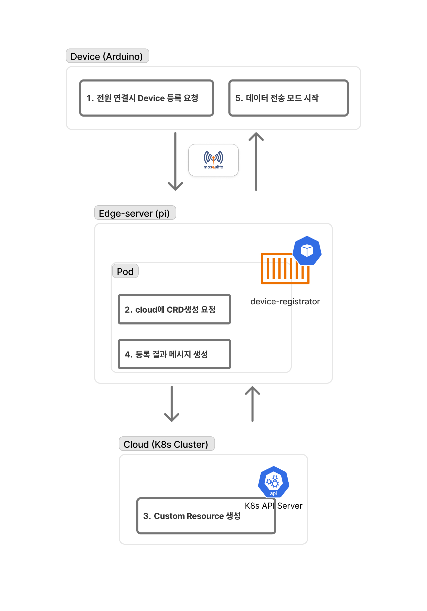

```
Arduino 부팅
  → ESP-01 MAC Address 기반 Device ID 생성 (예: 5C:CF:7F:12:34:56 → 5CCF7F123456)
  → MQTT Discovery 메시지 발행 (edge/zone{N}/discovery)
  → Pi의 device-registrator가 감지
  → Cloud K8s API Server에 CRD 자동 생성
  → Pi가 Arduino에 Registration 메시지 전송 (edge/zone{N}/status/{deviceId})
  → Arduino가 센서 데이터 전송 시작 (edge/zone{N}/data/{deviceId})
```

**ZTP 로그 - Arduino**

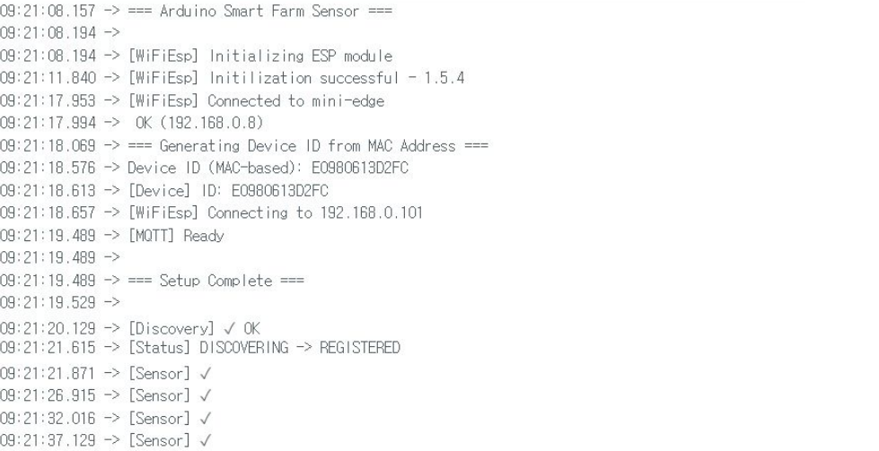

**ZTP 로그 - Pi**

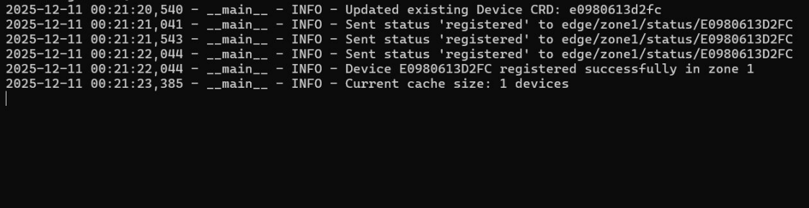

---

### 2. Edge Automation (데이터 파이프라인 및 자동 대응)

Pi의 data-validator가 센서 데이터를 집계·검증하고, 임계치 이탈 시 자동으로 대응 명령을 생성합니다.

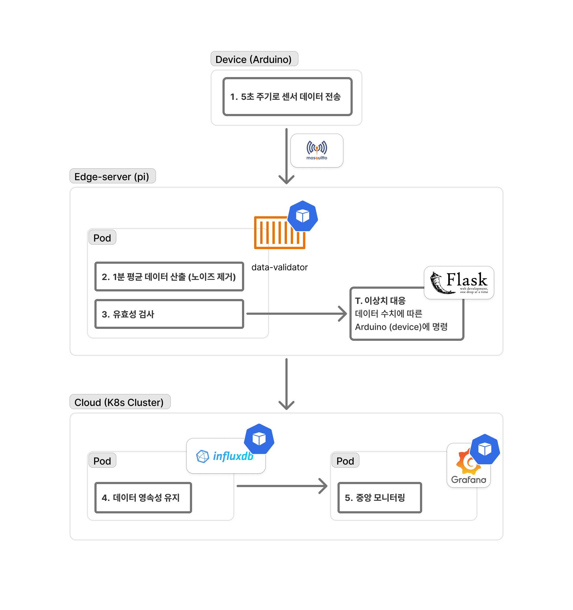

```
Arduino → 5초 간격 Raw data 전송
  → Pi 버퍼에 12개(1분치) 누적
  → 1분 평균값 산출 (노이즈 제거, 12:1 압축)
  → 유효성 검사 (temperature: -10~50℃, humidity: 0~100%, light: 0~1000lux)
  → 임계치 이탈 시 Flask 웹서버를 통해 Control Command 생성
  → 이후 Cloud InfluxDB로 전송
```

> Arduino UNO의 저장 공간 및 ESP-01 모듈의 대역폭 한계로, Arduino에 직접 명령을 전송하는 대신 Flask 웹서버 기반 Control Log로 대체 구현

**Control Log (Pi → Arduino 명령)**

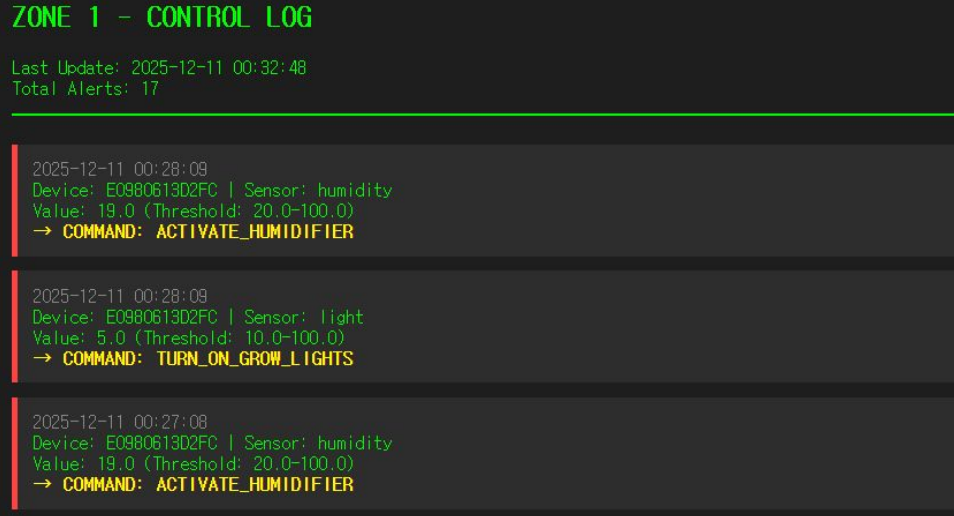

---

### 3. Central Monitoring (Grafana 대시보드)

Cloud의 Grafana 대시보드에서 전체 Zone의 디바이스 상태와 센서 데이터를 실시간으로 모니터링합니다.

**Grafana Central Dashboard**

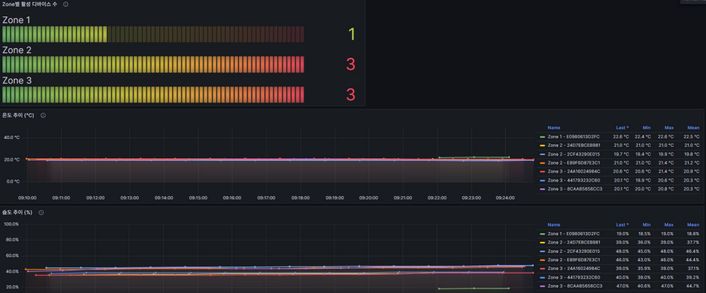

- Zone별 활성 디바이스 수 현황
- 온도·습도 Time Series (7개 디바이스 동시 표시)
- InfluxDB에 1분 집계 데이터(avg, min, max) 저장

**InfluxDB Data Explorer**

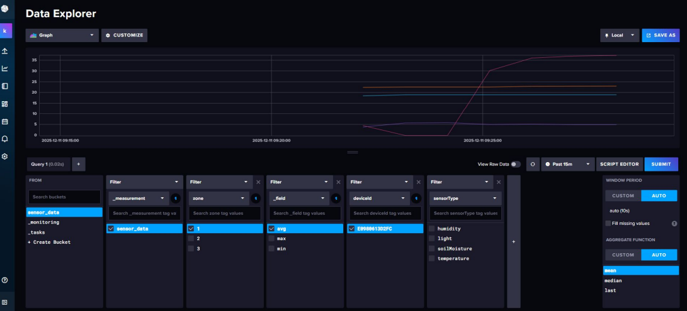

- `sensor_data` bucket에 zone, deviceId, sensorType 태그로 분류 저장
- avg / max / min 필드로 1분 집계값 조회 가능

---

## 하드웨어 구성

**Device Layer — Arduino UNO + ESP-01**

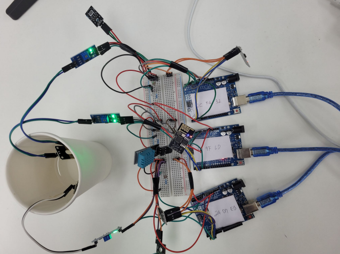

**Edge Layer — Raspberry Pi × 3**

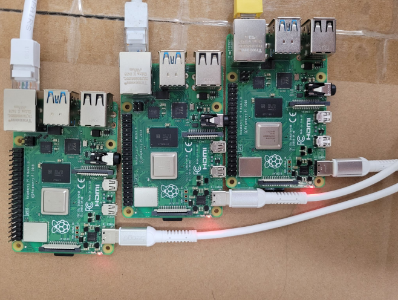

---

## MQTT 토픽 구조

| 토픽 | 방향 | 용도 |
|---|---|---|
| `edge/zone{N}/discovery` | Arduino → Pi | 디바이스 Discovery |
| `edge/zone{N}/status/{deviceId}` | Pi → Arduino | Registration 응답 |
| `edge/zone{N}/data/{deviceId}` | Arduino → Pi | 센서 데이터 전송 |

> 예시: Zone 1의 디바이스 `E0980613D2FC` → `edge/zone1/discovery`, `edge/zone1/status/E0980613D2FC`, `edge/zone1/data/E0980613D2FC`

---

## 레포지토리 구조

```
smart-farm-ZTP/
├── device/
│   └── arduino-uno/             # Arduino 펌웨어 (ESP-01 WiFi, MQTT, 센서 드라이버)
├── edge/
│   ├── alert_server/            # Flask 기반 Control Log 웹서버
│   ├── sys-backup/              # Pi 네트워크·KubeEdge Edgecore·MQTT 등 엣지 환경 설정 파일
│   ├── edge-setup.sh            # Pi 엣지 환경 초기 세팅 스크립트
│   └── mosquitto.conf           # Mosquitto 브로커 설정
└── cloud/
    ├── cloudcore/               # KubeEdge Cloudcore 매니페스트 및 배포 스크립트
    │   ├── kubeedge/            # KubeEdge CRD, Cloudcore 설정
    │   └── monitoring/          # InfluxDB, Grafana, Prometheus 매니페스트
    ├── edge-manifests/
    │   ├── registeration/       # ZTP device-registrator (Python, Dockerfile)
    │   └── data-validator/      # 데이터 집계·검증·InfluxDB 전송 (Python, Deployment)
    └── helm/                    # Cilium CNI, Rook-Ceph 헬름 차트
```

> `registeration`과 `data-validator`는 KubeEdge 특성상 Cloudcore가 매니페스트를 관리하여 `cloud/edge-manifests/` 하위에 위치합니다.

각 레이어별 상세 설명은 하위 디렉토리의 README를 참고하세요.
- [Device Layer](device/arduino-uno/README.md)
- [Edge Layer](edge/README.md)
- [Cloud Layer](cloud/README.md)

---

## 기술 스택

| 영역 | 기술 |
|---|---|
| Device | Arduino UNO, ESP-01 (ESP8266), DHT-11, GM5537-1, SZH-EK106 |
| Edge | Raspberry Pi 4, Python 3.12, Mosquitto MQTT, Flask, KubeEdge Edgecore |
| Cloud | Kubernetes, KubeEdge Cloudcore, InfluxDB 2.7, Grafana 10.0 |
| 통신 | MQTT (QoS 1), HTTP (REST) |

---

## 알려진 한계

- KubeEdge의 DeviceTwin, EventBus 등 일부 핵심 기능 미활용 (CNI 설정 이슈)
- Device CRD 생성만 구현, Status 갱신 기능 미구현
- Arduino UNO 저장 공간 및 ESP-01 대역폭 한계로 직접 제어 대신 Flask 기반 Control Log로 대체